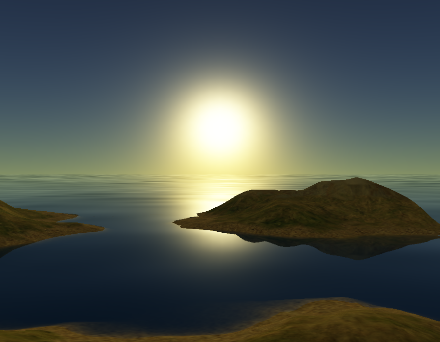

# Land

An F#/MonoGame program to draw a 3D landscape, including atmospheric scattering and water with refraction and reflection.

## Prerequisites

- [.NET Core SDK 6.0](https://dotnet.microsoft.com/download/)

## Building and running

To run the app locally use `dotnet run` within the `src\Land` folder.

## MonoGame content

Install the MGCB Editor with `dotnet tool install -g dotnet-mgcb-editor` to edit the `src\Land\content.mgcb` file if you add more content.